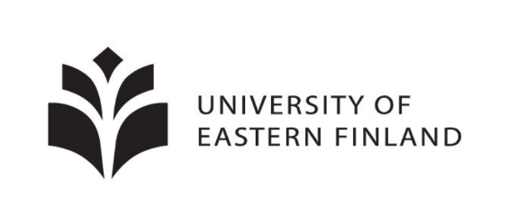

**Vuosina 2021-2023 järjestettiin hankerahoituksella paikallisia matematiikkakerhoja. Tämä hankerahoitus on loppunut.**

--------

Hellurei! Holá! Hej! Hallo! привет!

Syys-lokakuun taitteessa jatkuu keväällä 2021 alkanut Itä-Suomen yliopiston organisoima ilmainen matematiikkakerho yläkoululaisille ja lukiolaisille.
Kerho on tarkoitettu niille, jotka haluavat

-  tietää matematiikasta sen, mitä koulukirjoissa ei kerrota
-  päästä ratkomaan erilaisia haastavia tehtäviä
-  kahvitella muiden matematiikasta kiinnostuneiden nuorten kanssa (omat kahvit ja pullat esille)

Tapaamisissa tutustutaan matematiikan eri osa-alueisiin ja ratkotaan monen tasoisia tehtäviä. Aiheet eivät vaadi esitietoja, tärkeintä on kiinnostus matemaattiseen ongelmanratkaisuun ja halu oppia. MATERIAALIT OVAT UUSIA MYÖS VIIME KEVÄÄNÄ OSALLISTUNEILLE! Oletko ajatellut, että voisit joskus osallistua matematiikkakilpailuihin? Kerho on myös hyvää valmennusta niitä ajatellen!

Voit osallistua mistä päin maailmaa tahansa, sillä kerho järjestetään etänä Discord-alustalla noin kahden viikon välein torstaisin klo 17-19. Ensimmäinen kokoontuminen on 30.9. Kerhotoimintaan voit osallistua silloin kun se sinulle sopii, eikä haittaa, jos ensimmäinen tai joku muu tapaaminen jää välistä! Serverille pääset osallistumaan [täältä](https://discord.com/invite/8Jxpv5vbvB).

## Syksyn 2021 kerhokerrat

- 30.9. klo 17-19
- 14.10. klo 17-19
- 28.10. klo 17-19
- 4.11. klo 17-19
- 18.11. klo 17-19
- 25.11. klo 17-19
- 9.12. klo 17-19
- 16.12. klo 17-19

Kerhon vetäjänä toimii Laura Ylönen. Laura vastaa mielellään kaikkiin kerhoa koskeviin kysymyksiin sähköpostitse <laura.ylonen@uef.fi>. Kerhon järjestää Itä-Suomen yliopiston Fysiikan ja matematiikan laitos yhteistyössä Suomen matemaattisen yhdistyksen valmennusjaoston ja MAOLin kanssa.

Nappaa kaverikin mukaan ja osallistu kerhoon! Tervetuloa!

